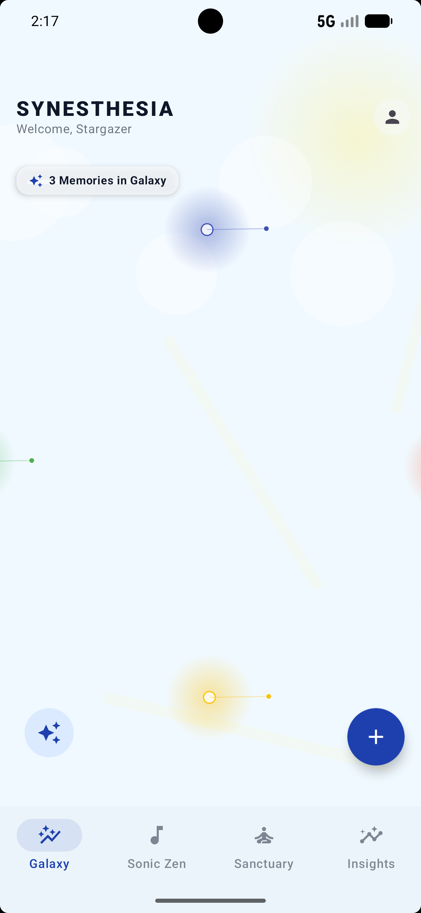
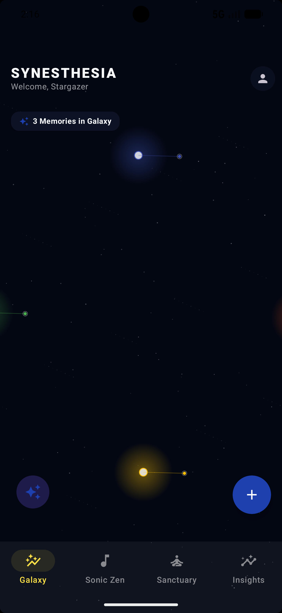
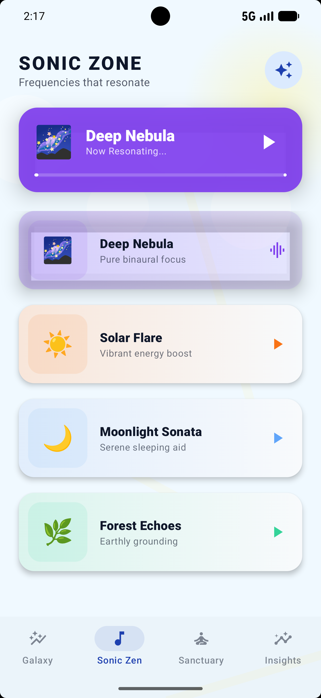
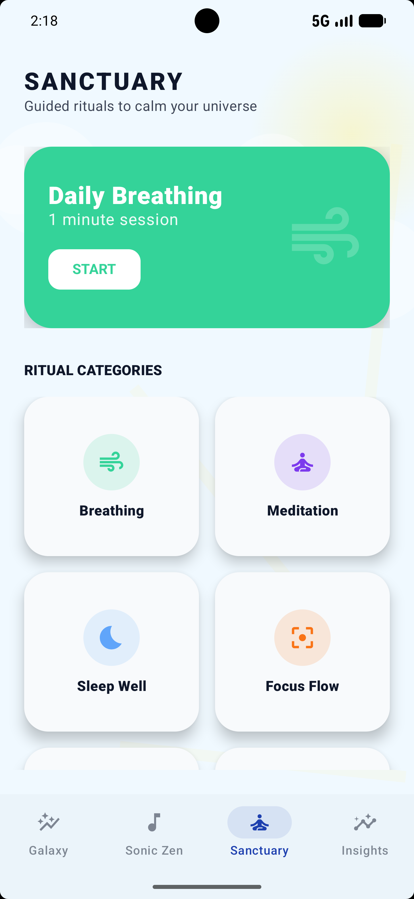

# 🌌 Synesthesia - AI-Powered Visual Journal Super-App


**Synesthesia** is an immersive, intelligent journaling ecosystem built with **Kotlin Multiplatform (KMP)**. It transforms traditional note-taking into a celestial sensory experience, blending state-of-the-art AI analysis with a dynamic visual language that responds to your emotional state.

---

## 📺 Visual Showcase

| ☀️ Daylight Mode (Normal) | 🌌 Astronomy Mode (Space) |
| :---: | :---: |
|  |  |
| *Clean interface with dynamic sky* | *Immersive galaxy with starfields* |

| 🧘 Sanctuary (Mindfulness) | 📊 Insights (Analytics) |
| :---: | :---: |
|  |  |
| *Interactive breathing & meditation* | *Real-time data-driven mood trends* |

### 🎥 Live Demo
[](https://youtube.com/shorts/Hg_JwBC4gr8?feature=share)

---

## 🚀 Key Features

### 🌕 Celestial Design System
*   **Dynamic Backgrounds**: Experience the "Daylight Sky" with pulsing sun and drifting clouds in Normal Mode, or the "Deep Space" galaxy with twinkling starfields in Astronomy Mode.
*   **Interactive Galaxy (Constellation)**: Your memories are rendered as glowing stars. Tapping a star reveals its resonance and connects you back to your past self.
*   **3D Interactive UI**: Clean, modern cards with realistic depth and clean Material iconography across all modules.

### 🤖 Intelligent Resonance (AI Engine)
*   **Automated Metadata**: Powered by **Google Gemini API**. AI automatically generates titles, paraphrases content poetically, and senses your emotion quadrant.
*   **AI Perspective**: Get intelligent summaries of your weekly emotional trends in the Insights tab.
*   **Spotify AI Integration**: Personalized playlist recommendations triggered by your current "Galaxy Mood".

### 🧘 Holistic Well-being Modules
*   **Sonic Zone**: Immersive audio frequencies (Binaural beats, Nebula noise) with an active playback system.
*   **Sanctuary**: Functional mindfulness rituals including Guided Breathing (with timer), Meditation, and Gratitude.
*   **Insights**: Deep emotional analytics with custom-drawn mood charts and live database synchronization.

---

## 🏗️ Architecture & Technology Stack

### Technical Overview
Synesthesia is built following **Clean Architecture** principles to ensure a scalable and maintainable codebase:
-   **Presentation**: Compose Multiplatform with MVVM (StateFlow/SharedFlow).
-   **Domain**: Pure Kotlin business logic, Interactors (Use Cases), and Repository Interfaces.
-   **Data**: SQLDelight (Local), Ktor (Remote API), and DataStore (Preferences).

### Core Stack
| Layer | Technology |
|---|---|
| **Language** | Kotlin (100%) |
| **Framework** | Compose Multiplatform (1.7.0) |
| **Dependency Injection** | Koin (4.0.0) |
| **AI Integration** | Google Gemini API |
| **Database** | SQLDelight (2.0.2) |
| **Networking** | Ktor Client (3.0.1) |
| **Concurrency** | Kotlin Coroutines & Flow |

---

## 📁 Project Structure
```bash
composeApp/src/commonMain/kotlin/com/example/synesthesia/
├── core/                      # DI, Network, App-wide Utils
├── data/                      # DTOs, Local DB, API implementation
├── domain/                    # Entities, Repositories, Use Cases
└── presentation/
    ├── app/                   # Root App UI & Theme
    ├── components/            # CelestialBackground, ConstellationCanvas, etc.
    ├── navigation/            # Type-safe routing (MainScreen with BottomNav)
    └── screens/               # Galaxy, SonicZen, Sanctuary, Insights, AddNote
```

---

## 👥 Development Team

| Info | Role |
| :--- | :--- |
| **Garis Rayya Rabbani** | **Lead UI/UX & Presentation Engineer**<br>Celestial Design System, Animations, Navigation Architecture |
| **Reyhan Oktavian Putra** | **Domain & Data Infrastructure Engineer**<br>AI Integration, SQLDelight Core, Business Logic |

---

## 🛠️ Setup Instructions

1.  **Clone the Repository**
    ```bash
    git clone https://github.com/GarsRayy/NoteAI-Synesthesia.git
    ```
2.  **API Key Configuration**
    Add `GEMINI_API_KEY=your_key_here` to your `local.properties` file.
3.  **Environment**
    Recommended IDE: **Android Studio Ladybug (2024.2.1) or newer**.
4.  **Run Application**
    Execute the Gradle task `:composeApp:installDebug` for Android or the corresponding iOS target.

---
*Developed with ❤️ as a major project for Mobile Application Development - ITERA.*
